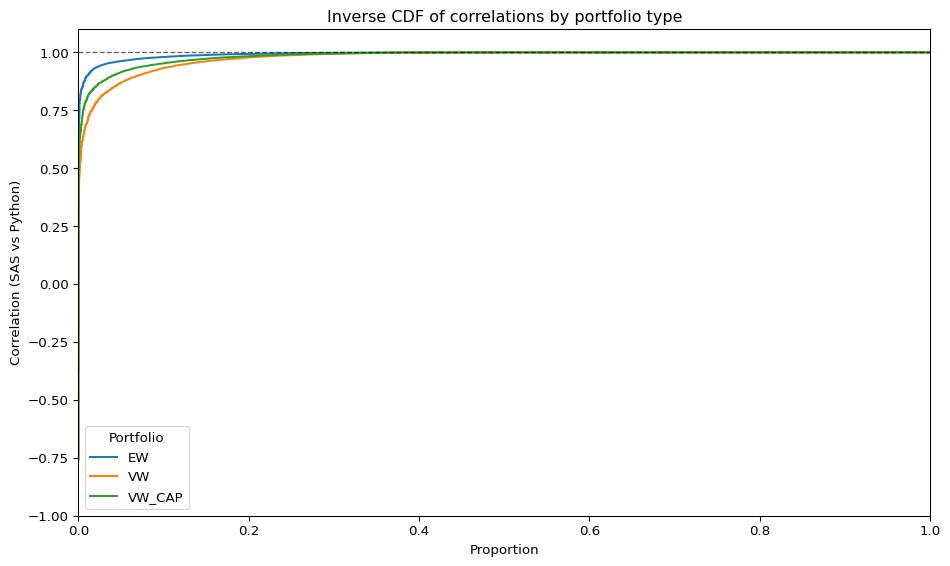

# JKP factors migration to Python

## Introduction

We’re excited to announce the release of the newest version of the code
that generates the database used in [“Is There a Replication Crisis in
Finance?”](https://onlinelibrary.wiley.com/doi/full/10.1111/jofi.13249)
(Jensen, Kelly, and Pedersen, *Journal of Finance* 2023), as well as the
factor portfolio returns.

**Highlights of this release:**

-   **Migration to Python:** We’ve switched from SAS and R to Python.
-   **Modular, faster codebase:** The code is now more modular and
    leverages Polars and DuckDB for performance.
-   **Single-command execution:** The characteristics database and
    factor returns can be computed in a single Slurm job or a single
    Python command.
-   **Substantial speed-ups:** The full database and factor returns can
    be generated in ~6 hours.
-   **Modern output formats:** Outputs have moved from CSV to Parquet.

For details on factor definitions and construction, see: [Global Factor
Data](https://jkpfactors.com).

Naturally, changing the programming language led to some differences in
the underlying algorithms relative to SAS. Nevertheless, most functions
and the overall structure of the SAS/R codebase have been retained. The
existing SAS/R documentation remains applicable and, in many cases, is
more extensive than the current Python documentation.

## Output structure

All output is contained in:

    SAS-Python-Migrate/build_database/data/processed/

The output is organized as follows:

    processed/

1.  **accounting_data/**
    -   `quarterly.parquet` and `annual.parquet` contain stock-level
        accounting characteristics from Compustat data sourced from
        quarterly and annual filings, respectively.
2.  **characteristics/**
    -   `world_data_unfiltered.parquet` contains the monthly stock file
        with stock-level characteristics, without filters.
    -   `world_data_filtered.parquet` contains the monthly stock file
        with stock-level characteristics filtered by  
        `primary_sec == 1` (primary security flag), `common == 1`
        (common stock flag), `obs_main == 1` (main observation flag),
        `exch_main == 1` (main exchange flag).
    -   Partitions of `world_data_filtered.parquet` by country (e.g.,
        `GBR.parquet`, `USA.parquet`). Files are named using [ISO
        Alpha-3 country
        codes](https://www.nationsonline.org/oneworld/country_code_list.htm).
3.  **other_output/**
    -   `ap_factors_monthly.parquet` and `ap_factors_daily.parquet`
        contain the returns of FF3 and HXZ4 factor portfolios for every
        country at monthly and daily frequencies, respectively.
    -   `market_returns.parquet` and `market_returns_daily.parquet`
        contain market-portfolio returns for every country at monthly
        and daily frequencies, respectively.
    -   `nyse_cutoffs.parquet` contains NYSE market-capitalization
        quantiles used for portfolio construction.
    -   `return_cutoffs.parquet` and `return_cutoffs_daily.parquet`
        contain return quantiles used as winsorization thresholds.
4.  **portfolios/**
    -   `pfs(_daily).parquet` contains portfolios formed at monthly
        (daily) frequency by sorting stocks into three groups based on
        non-microcap breakpoints. Portfolio 1 (3) includes stocks with
        the lowest (highest) value of the characteristic.
    -   `hml(_daily).parquet` contains long–short portfolios formed at
        monthly (daily) frequency that go long Portfolio 3 (high
        characteristic values) and short Portfolio 1 (low characteristic
        values) from `pfs.csv`.
    -   `lms(_daily).parquet` contains long–short portfolios formed at
        monthly (daily) frequency following the Jensen, Kelly, and
        Pedersen (2022) signing convention (e.g., long low-asset-growth,
        short high-asset-growth).
    -   `cmp(_daily).parquet` contains rank-weighted
        (characteristic-managed) portfolios formed at monthly (daily)
        frequency within mega, large, small, micro, and nano
        capitalization groups in the U.S.
    -   `country_factors(_daily)/` contains country-by-country
        `lms.parquet` files for easier use at monthly (daily) frequency.
        Files are named using [ISO Alpha-3 country
        codes](https://www.nationsonline.org/oneworld/country_code_list.htm).
    -   `regional_factors(_daily)/` contains regional factor portfolios
        based on `lms.parquet` at monthly (daily) frequency, constructed
        following Jensen, Kelly, and Pedersen (2022).
    -   `clusters(_daily).parquet` contains cluster outputs.  
    -   `regional_clusters(_daily)/` contains regional cluster
        outputs.  
    -   `industry_gics.parquet` contains GICS industry-level outputs.
5.  **return_data/**
    -   `world_dsf.parquet` contains daily stock-level returns for all
        securities in the database.
    -   `world_ret_monthly.parquet` contains monthly stock-level returns
        for all securities in the database.
    -   `daily_rets_by_country/` contains partitions of
        `world_dsf.parquet` by country (e.g., `GBR.parquet`,
        `USA.parquet`). Files are named using [ISO Alpha-3 country
        codes](https://www.nationsonline.org/oneworld/country_code_list.htm).

The `SAS-Python-Migrate/build_database/data/processed/` directory also
contains two additional subfolders, `raw/` and `interim/`, used by the
code to store temporary data for computing stock-level characteristics.

Function behavior in Python relative to the SAS/R portions is close to
identical, with changes in `standardized_accounting_data` for more
precise handling of duplicates.

There are slight divergences between outputs, the main sources of them
are:

-   **Numerical precision:** Differences in floating-point handling
    between SAS and Python can alter inequality evaluations and
    calculated values.
-   **Data revisions:** Underlying data may have changed.
-   **Algorithmic adjustments:** Differences due to updates in
    `standardized_accounting_data` for improved duplicate handling.

To demonstrate the quality of the new dataset, we compare the
characteristics and factors produced by the SAS/R code with those from
the new Python code.

## Comparison of characteristics at stock level

We can compare the correlation of the characteristics produced by the
SAS portion of the previous version of the code and Python. For that
purpose, we compute the Spearman rank correlation of each of the
characteristics.

The plot below shows a histogram of the rank correlation:

What this shows is that if characteristics are used to sort stocks, the
resulting portfolios should be roughly identical to those produced in
SAS.

The underlying data for the comparison is available here:
[`sas_vs_py_summ_stats.parquet`](data/sas_vs_py_summ_stats.parquet).

There are only 2 characteristics with Pearson correlation lower than
95%: ‘resff3_6_1’ and ‘resff3_12_1’. Looking at rank correlation and
other distributional measures, we can see that even if the Pearson
correlation is small, the distributions align closely together and the
difference in moments and correlations is due to outliers.

In the new Python code, the ‘div’ and ‘eqnpo’ characteristics in the
`market_chars_monthly` subroutine are coerced to 0 whenever their
magnitude falls below 1e-5, in order to eliminate arithmetic noise.

For a fair comparison of characteristic outputs, we have likewise set
‘div’ and ‘eqnpo’ to 0 in the SAS results whenever their magnitued is
smaller than 1e-5. However, note that the portfolio return comparisons
shown at the beginning were made using the previous SAS output, before
applying the zero-floor adjustments to ‘div’ and ‘eqnpo’.

## US factor comparison

First, we examine correlations between U.S. long–short factor-portfolio
returns produced by SAS/R and Python. In this setting, we aim for a
correlation of 1 for each factor.

As shown above, all factors have correlations very close to 1.

Next, we compare the mean returns and standard deviations of the
factors. In the scatter plots below, the x-axis shows the statistic for
SAS/R and the y-axis shows the corresponding statistic for Python. If
the two versions match, the points should lie on a 45-degree line
through the origin (slope 1, intercept 0).

Again, the Python and SAS/R results align closely.

## World ex-US factor comparison

We now repeat the comparison for the World ex-US region.

Here, factors differ more than in the U.S. sample. However, performance
remains strong with all factors having a correlation above 90%.

Overall, the mean and standard deviation of the factor returns are close
to those produced in SAS/R.

## Correlation by factor-country

Finally, we examine correlations at the factor–country level. For each
characteristic and country, we compare the SAS and Python return series
of the corresponding factor portfolios. The figure below summarizes
these comparisons by plotting the inverse cumulative distribution of the
correlations for each portfolio type (EW, VW, VW_CAP), showing the
proportion of factor–country portfolios that achieve at least a given
correlation.

